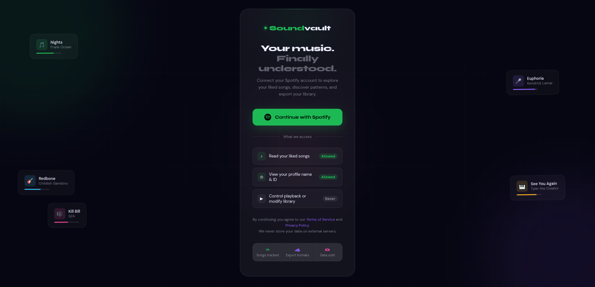

# 📚 LibraryLens

> A personal Spotify library dashboard — explore, analyze, and export your liked songs.

LibraryLens connects to your Spotify account and turns your liked songs into a living dashboard. See your top artists, genre breakdown, discovery timeline, and export your entire library in multiple formats — all in one place.

Built with Django as a hands-on learning project covering OAuth, API integration, ORM querying, and data visualization.

---

## Screenshots

> Dashboard · Explorer · Export



---

## Features

- **Spotify OAuth login** — secure login via Spotify, no passwords stored
- **Library sync** — fetches your entire liked songs library from the Spotify API
- **Dashboard** — total songs, unique artists, genre count, avg. release year, songs-per-year chart, top artists, genre breakdown, newest vs oldest liked song
- **Explorer** — paginated, searchable, filterable song table with sort by date added, popularity, or release year
- **Export** — download your library as CSV, JSON, plain text, or Markdown

---

## Tech Stack

- **Backend** — Python, Django
- **Auth** — Spotify OAuth 2.0 (manual implementation, no third-party auth library)
- **Database** — PostgreSQL
- **Frontend** — Vanilla HTML/CSS/JS, glassmorphism UI
- **API** — Spotify Web API

---

## Getting Started

### 1. Clone the repo

```bash
git clone https://github.com/yourusername/librarylens.git
cd librarylens
```

### 2. Create a virtual environment

```bash
python -m venv venv
source venv/bin/activate       # Mac/Linux
venv\Scripts\activate          # Windows
```

### 3. Install dependencies

```bash
pip install -r requirements.txt
```

### 4. Create a Spotify app

1. Go to [developer.spotify.com/dashboard](https://developer.spotify.com/dashboard)
2. Click **Create App**
3. Set the redirect URI to `http://localhost:8000/callback/`
4. Copy your **Client ID** and **Client Secret**

### 5. Configure environment variables

Create a `.env` file in the root directory:

```env
SECRET_KEY=your_django_secret_key

SPOTIFY_CLIENT_ID=your_client_id
SPOTIFY_CLIENT_SECRET=your_client_secret
SPOTIFY_REDIRECT_URI=http://localhost:8000/callback/

DB_NAME=librarylens
DB_USER=your_db_user
DB_PASSWORD=your_db_password
DB_HOST=localhost
DB_PORT=5432
```

### 6. Run migrations

```bash
python manage.py migrate
```

### 7. Start the server

```bash
python manage.py runserver
```

Visit `http://localhost:8000` — log in with Spotify, sync your library, and explore.

---

## Project Structure

```
librarylens/
├── accounts/               # Auth, Spotify OAuth, token management
│   ├── models.py           # SpotifyToken model
│   ├── views.py            # login, callback, logout, index
│   └── urls.py
├── library/                # Song model and sync logic
│   ├── models.py           # Song model
│   ├── views.py            # sync_library, export views
│   └── urls.py
├── templates/
│   ├── login.html          # Login page
│   └── accounts/
│       └── index.html      # Main SPA (dashboard, explorer, export)
├── static/
└── librarylens/
    ├── settings.py
    └── urls.py
```

---

## Environment Variables

| Variable | Description |
|---|---|
| `SECRET_KEY` | Django secret key |
| `SPOTIFY_CLIENT_ID` | From Spotify Developer Dashboard |
| `SPOTIFY_CLIENT_SECRET` | From Spotify Developer Dashboard |
| `SPOTIFY_REDIRECT_URI` | Must match exactly in Spotify dashboard |
| `DB_NAME` | PostgreSQL database name |
| `DB_USER` | PostgreSQL user |
| `DB_PASSWORD` | PostgreSQL password |
| `DB_HOST` | Database host (default: localhost) |
| `DB_PORT` | Database port (default: 5432) |

---

## Key Concepts Practiced

This project was built as a Django learning exercise. Concepts covered:

- OAuth 2.0 flow — manual implementation without libraries
- Token storage and refresh logic
- Django ORM — `annotate`, `values`, `Count`, `Avg`, `distinct`
- `update_or_create` for idempotent API syncing
- Class-based pagination with `Paginator`
- Django template tags — ``, ``, `|date`, `|title`
- File download responses — `HttpResponse` with `Content-Disposition`
- GET-based filtering and sorting without JavaScript

---

## Roadmap

- [ ] Background sync with Celery (for large libraries)
- [ ] Songs added per month chart (more granular than per year)
- [ ] Duplicate detection across albums/remasters
- [ ] Playlist generator from liked songs

---

## License

MIT
